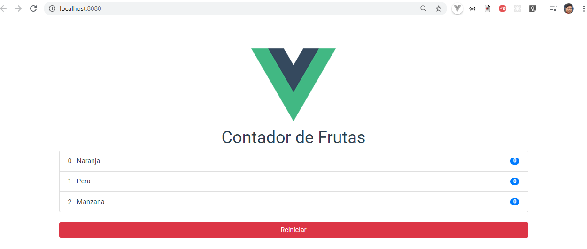

# Mi Primera Aplicación usando Vuex

## Descripcion

```
En esta aplicacion, se realizan practicas uzando vuex para el control de estados en Vue.
Para estilos del Frontend se ha tomado como maquedator Boostrap.
```

## Frontend de la Aplicacion



### Compila y recarga los archivos en modo Desarrollo

```
npm run serve
```

### Compila y Minimiza los archivos para el despliegue de Producción

```
npm run build
```

### Configuración Personalizada

See [Configuration Reference](https://cli.vuejs.org/config/).
